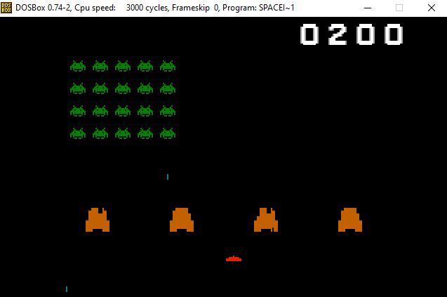

# Space-Invaders
10th grade space invaders assembly project

### To run:
Download DOSBox [here](https://www.dosbox.com/download.php?main=1).

Once inside mount the disk to which you downloaded the repository and cd to it:
``` 
mount d: d:/
d:
cd SPACE-~1/BIN
```
And then run the game:
```
SPACEI~1.EXE
```

### To re-assemble:
Inside DOSBox run:
```
TASM.EXE SPACEI~1.ASM
TLINK.EXE SPACEI~1.OBJ
```
And then run the game as normal:
```
SPACEI~1.EXE
```
Make sure all the .BMP images are in the same folder as the executable.
    

